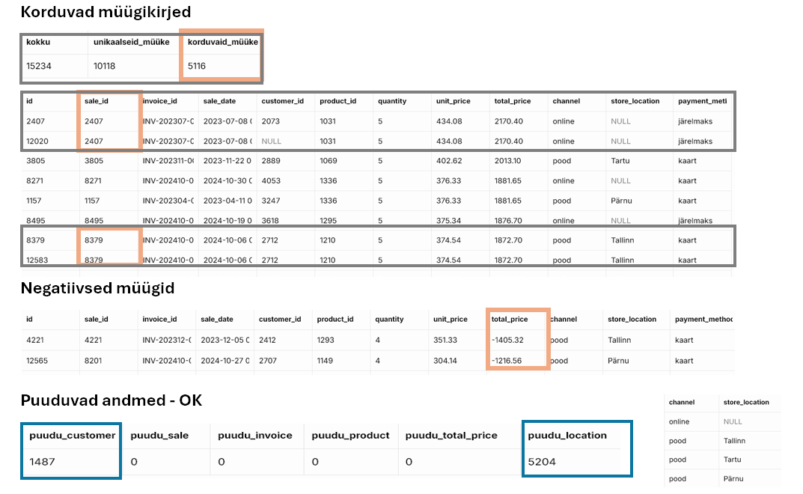
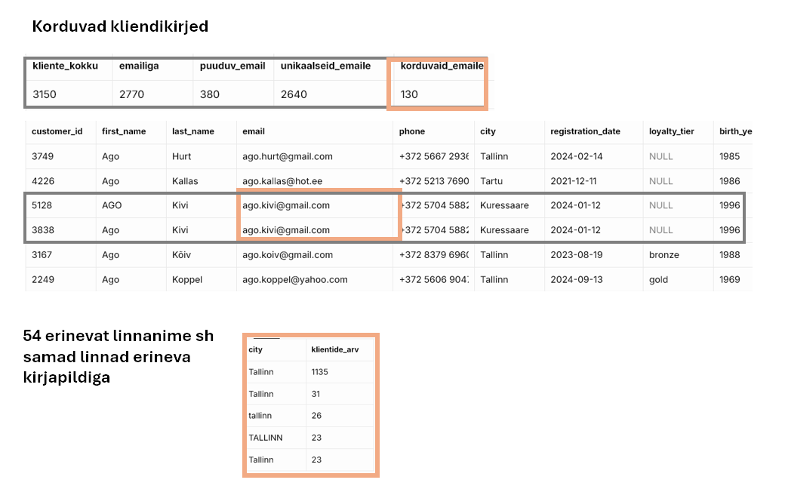
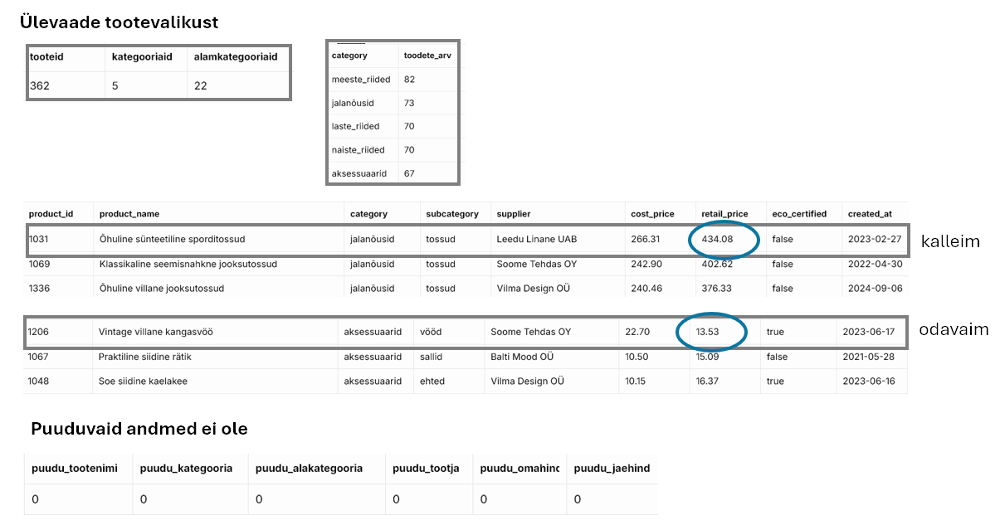

## Week 1 - SQL Basics
### Eesmärk: uurida andmestikku ja koostada esmane andmekvaliteedi raport
Enne edasisi analüüse on vaja hinnata andmete kvaliteeti: saada ülevaade olemasolevatest andmetest, leida duplikaadid, puuduvad väärtused, ebaloogilised andmed. 

### Mida tegin?
- Uurisin SQL päringutega tabeleid "sales", "customers", "products"
- Põhilised käsud: SELECT, FROM, WHERE, ORDER BY, LIMIT, DISTINCT, COUNT

### Põhilised tulemused:
**Sales** tabelis on kokku 15 234 müügitehingut (rida), millest 5116 on potentsiaalsed duplikaadid. See võib moonutada müügitulemuste ülevaadet. 305 negatiivset tehingut (~2%), tõenäoliselt tagastused, mida ei tohi müügituluga segamini ajada. ~10% tehingutest on teinud registreerumata kliendid (st customer_id puudub). Online poe puhul asukoht puudub, mis on loogiline. 

 

**Customers** tabelis on 3150 registreerunud klienti (rida). Registreerumised on vahemikus 2020-01-02 kuni 2025-02-27. 130 klienti on registreeritud korduva e-mailiga — need on potentsiaalsed duplikaadid. Enne puhastamist tuleb uurida kas duplikaadid on seotud tellimustega. Edaspidi soovitame kokku leppida, mis defineerib unikaalse kliendi (e-mail? e-mail + nimi?). Linnanimedes on 54 erinevat väärtust sest sama linn on kirjutatud mitmel viisil (Nt Tallinnal on 5 kirjapilti). 

Customers tabeli tulemused (pilt)

 

**Products** tabelis on 362 toodet (rida), mis kuuluvad 5 kategooriasse. Tooteid leidub hinnavahemikus 13 - 434 eur. Puuduvaid andmeid olulistes väljades ei ole. Kirjapildi ühtsus ja võimalikud duplikaadid vajavad edasist kontrolli.

Products tabeli tulemused (pilt)

### Projekti failid:
w1_sales_exploration.sql  
w1_customers_exploration.sql  
w1_products_exploration.sql  
w1_sales_screenshot.png  
w1_customers_screenshot.png  
w1_products_screenshot.png

